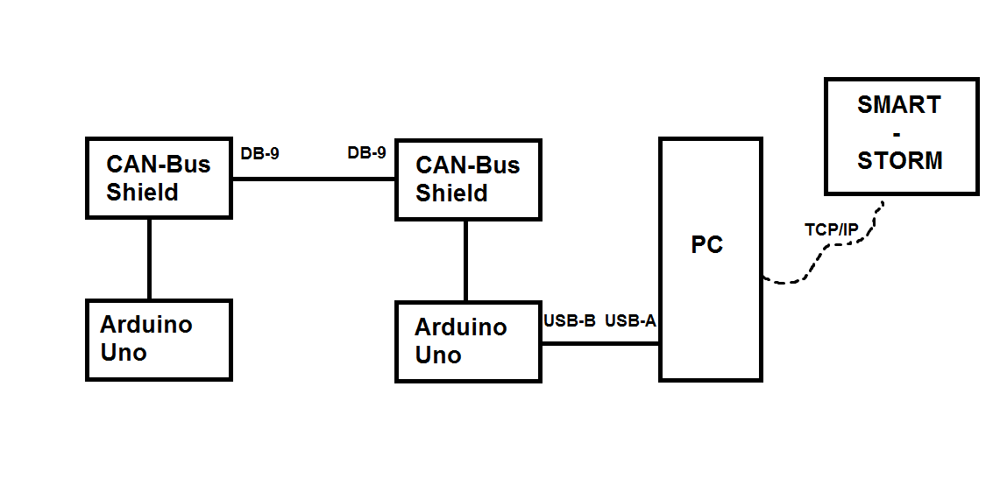

# storm-can-node

# Goal of the project
Create measurement application with the communication over CAN bus. Devices that are supposed to be used in this project are Arduino + CAN-Bus Shield + CAN sensors.

# Devices
We used in this project 2xArduino connected with CAN-Bus shields. Power supply is provided to both Arduino boards from PC's USB ports. Shields are communicating through CAN bus and are connected by DB9-DB9 wire. We did not use any CAN sensors but generated random data instead just to show possibilities of CAN bus.
Here is a diagram showing connections between different elements of system.

# How to run project
0. Download CAN_BUS_Shield library from Seeed-Studio (https://github.com/Seeed-Studio/CAN_BUS_Shield) and attach it to Arduino IDE.
1. Compile and upload INO files (sender/sender.ino or receiver/receiver.ino) onto Arduino boards.
2. Connect Arduino boards with shields.
3. Connect shields by DB9-DB9 wire.
4. Provide internet connection to your PC (required to connect to smart-storm).
5. Provide power supply to Arduino boards.
Note: it is important to connect receiver board first, then sender one.
6. Run python script computer/send.py.
